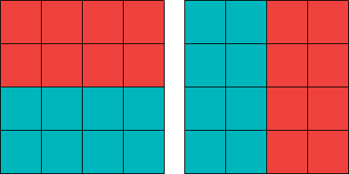
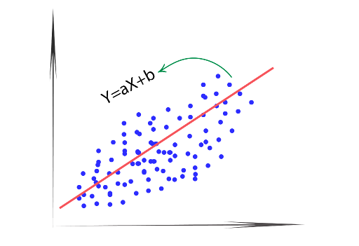
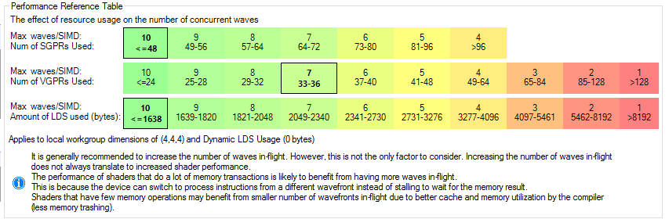

# How does Betsy work?

GPU encoding is all about exploiting parallelism.
The first obvious attempt is to compute each compressed block (usually composed of blocks of 4x4 pixels which is what most format use) in each GPU thread.

But that approach can only take you so far, and may produce very large kernels, aka fat kernels. And GPUs don't like fat kernels.

We can exploit GPU parallelism further.

## The 'easy' compression schemes

See, certain compression schemes have a mathematically optimal solution. This is the case of BC1 and BC4 (and by extension, BC3 and BC5). Follow a simple algorithm and you'll arrive at the best possible result.

And that's why CPU versions are so fast and GPU encoders can't improve much in this area.

Sure, a GPU version can process more blocks in parallel than a CPU. But in reality it takes pretty much the same time because GPU encoders have the additional overhead of copying data to GPU memory then back to CPU to get the results.

Does this means betsy is useless when it comes to BC1 and BC4? NO! The main benefit in this case is being able to run both a CPU and GPU decoder at the same time, which could roughly halve encoding time.

Also it's worth noting that Betsy compute shaders are still useful if you want to immediately convert to BC1 a texture that was already on the GPU (i.e. screenshot a render maybe?) since you no longer have to pay the cost of the upload overhead.

## The partial and full brute force compression schemes

Then there's the rest of the algorithms, like ETC1, ETC2, EAC, BC6H.

Each block in these compression schemes have **multiple modes of operation**. And (so far) there is no algorithm to guarantee which mode will give best results. The solution? **TRY THEM ALL**, aka brute force.

Some compression schemes like ETC1 and BC6H have algorithms to arrive faster at a good result, i.e. they narrow a full brute search to a more manageable search space. However there's still a lot of 'try and test' multiple combinations, only to finally keep the one with the lowest error.

# ETC1 encoder

The original ETC1 encoder Betsy is based on was written by Rich Geldreich.

He uses an algorithm for narrowing down the search within the colour space and then follows several refinement steps to improve the accuracy of the interpolation. This code was left untouched (other than syntax changes to adapt it to GLSL or avoid driver bugs, make if more GPU friendly, etc).

So what changed between his CPU implementation and our GPU version?

ETC1 divides the 4x4 block in two subblocks of either 4x2 or 2x4 (ie. divide the 4x4 block either horizontally or vertically). Additionally there's two possible modes:

 - Both subblocks are independent, encoded in RGB444 (that is 4 bits per channel)
 - Both subblocks are dependent. One is encoded in RGB565 (that is 5 bits for R and B, 6 for Green) and the other subblock is calculated using a delta. e.g. subblock1 = subblock0 + delta.

While RGB565 gives more colour variety (i.e. higher quality) for the 1st subblock, the 2nd subblock is much more constrained, which makes it perform poorly with heterogeneous / high frequency data.

In fact some of the RGBA565 + delta combinations are completely invalid (because the result either underflows below 0 or overflows above 255), and ETC2 will later take advantage of this flaw to add new modes and further increase quality.



*ETC1 supports two subblocks of 4x2 (left) or two subblocks of 2x4 (right)*

So let's see what we can parallelize:

 1. We can try the vertical and horizontal schemes (2x4 vs 4x2) in parallel: 2x parallelism so far
 1. We can calculate both RGB444 and RGB565 modes in parallel: 4x parallelism so far
 1. We can NOT compute the subblocks separately. Although we could compute the RGB444 subblocks separetely, we cannot do such thing for RGB565 modes as the 2nd subblock depends on the 1st one. While we could try computing RGB444 subblocks independently and RGB565 subblocks serially, this complicates synchronization because threads working on RGB444 would finish sooner than the threads computing RGB565 subblocks. Not worth it

So!!! As it turns out, **we can use 4 threads per block!**

 1. 4x2 scheme, RGB444
 1. 2x4 scheme, RGB444
 1. 4x2 scheme, RGB565 + delta
 1. 2x4 scheme, RGB565 + delta

After all threads are done computing each variation, they calculate the error.

Then synchronize and thread 0 checks which thread is the winner (i.e. error is lowest).
Then the winner thread gets to write its result.

Therefore if we are encoding a 1024x1024 texture, which needs 256x256 blocks, instead of using 256x256 = 65.536 threads, we can now 4x that amount, thus we can launch 262.144 threads. Nice!

# EAC

EAC is an easy one and possibly my favourite one. EAC is more similar to BC4, meant to encode greyscale data such as roughness maps and heightmaps, or two-channel data like normal maps (assuming Z can be mathematically derived, like in BC5).

It consists of a 8-bit base value, a look up table (its contents defined by spec) to act as delta and a multiplier for that table.

Thus decoding an EAC block boils down (pseudo code, high level) to:

```
output_pixel[y][x] = base + lookupTable[tableIdx][i] * multiplier
```

Where:
 - `base` is an 8-bit value (per block)
 - `tableIdx` is a 4-bit value (per block)
 - `multiplier` is a 4-bit value (per block)
 - `i` is a 3-bit value (per pixel)

While I believe there's quite possibly an algorithm to optimize the search, the truth is, we don't need any!

The search space is very small, enough for brute force to be feasible, and we get the guarantee of finding the best possible result!

Regarding parallelization, I opted for processing each value of `base` in its own thread. Because it's an 8-bit value, that means there is 256 threads per block.

While it may be possible to parallelize further, I didn't think it was worth the extra synchronization problems this could present, like needing more shared memory, which could hinder occupancy (this is bad). There's also a sweetspot between how many threads you launch and how much work each thread performs. GPUs don't like very short-living threads.

What about `tabletIdx`, `multiplier` and `i`? Let's do the math:

`16 * 16 * 3 = 768`

That means each of the 256 threads needs to iterate 768 times to find the best combination of `tabletIdx`, `multiplier` and `i` for the given `base` this thread is processing. For a GPU, this is barely a walk in the park.

Therefore if we are encoding a 1024x1024 texture, which needs 256x256 blocks, instead of using 256x256 = 65.536 threads, we can now 256x that amount, thus we can launch 16.777.216 threads, and also be certain we got the best possible result. This is the best case scenario!

Perhaps a bit overkill, but I'm very happy with the results. It's fast and guaranteed to be the best. This turned out to be a very GPU-friendly encoding format.

## EAC Remarks

### Remark 1

EAC has two flavours: EAC11, which is meant for heightmaps and normal maps, meant to encode sources of 11-bits grayscale textures (yeah I know, 11 bits is an odd choice. Heightmaps are usually encoded in 16 bits. I guess it's much better than 8, but still not 16...), and EAC used for encoding Alpha in ETC2 RGBA, which assumes Alpha is originally 8-bit rather than 11.

The algorithm used to encode both EAC11 and ETC2+EAC is exactly the same, but the math is slightly different as some coefficients are altered, most specifically the `base` and `multiplier` are first converted by fixed constants. The shader isolates these minor differences with an #ifdef R11_EAC macro

### Remark 2

This encoder is loosely inspired in [etc2_encoder](https://github.com/titilambert/packaging-efl/blob/master/src/static_libs/rg_etc/etc2_encoder.c) by Jean-Philippe ANDRE as he used brute force too. However his implementation contained a few bugs as it uses a weird for loop to iterate the `base`:

```
for (int step = 0; step < base_range; step += base_step)
	for (base_codeword = clampi(avg - step);
		base_codeword <= clampi(avg + step);)
```

and given the right inputs turns out this loop attempts to calculate the same value of `base` multiple times, therefore it unnecessarily affects performance by doing redundant work. It's also possible it doesn't search all `base` values. I didn't look it further because it was clearly running into some bugs.

### Remark 3

Once all threads are done, we use [parallel reduction](https://www.eximiaco.tech/en/2019/06/10/implementing-parallel-reduction-in-cuda/) to find the thread who arrived to the best result.

Why parallel reduction? Because it takes us only 8 iterations to find the best thread.

If we only used thread 0, we would need 256 iterations. This doesn't sound that bad until we realize AMD GCN executes 1 instruction every 4 cycles. This is not a problem when running 64+ threads, but it is really bad if you only have ONE thread doing all the work. GPUs are meant to be executed in parallel. Putting all the work into a single thread is bad.

AMD Navi runs 1 instruction every 1 cycle, however each instruction still has a 4-cycle latency before the results can be used and relies on both thread- and instruction-level parallelism to hide that latency. Reduction algorithms are pretty much dependent thus not much can be hidden with instruction-level parallelism either.

NVIDIA does not disclose the details of their architecture but one must assume it is subject to similar problems. It is only natural given GPUs optimized for parallel tasks, not to run a single thread.

Anyway, the problem is solved using parallel reduction since it's the best fit for this type of Hardware.

Betsy includes both code to gather the result in thread 0 and using parallel reduction, but the former is disabled. This is included for ground-truth check in case there's a bug in the parallel reduction code.

# ETC2

ETC2 improved on ETC1 by taking advantage of invalid combination of RGB565 + delta mode which ended in under/overflow, as we mentioned.

By using these invalid combinations, ETC2 was able to introduce 3 new modes:

T, H and P.

This means ETC2 is *backwards compatible*. All ETC2 HW can decode ETC1 textures, but ETC1 HW cannot properly decode ETC2 textures.

T and H are almost identical, thus we run them in the same compute shader. While P mode gets its own compute shader.

## TH modes

I based my implementation of T & H from [etc_encoder](https://github.com/titilambert/packaging-efl/blob/master/src/static_libs/rg_etc/etc2_encoder.c) by Jean-Philippe ANDRE

The T and H modes is basically similar to BC1 by using endpoint interpolation (in RGB444), while dodging BC1's patent infringiment by stamping predefined tables on top of it (similar to what EAC does) rather than directly interpolating the endpoints.

So instead of storing interpolation weights in the block like BC1 does, ETC2 stores an index to a lookup table containing the interpolation weights. This results in lower quality than BC1, but is a good workaround to the patent; and ETC2 can rely on the other modes (the old ones from ETC1 and the new P mode) to still achieve good quality.

Our T/H modes are processed by two compute shaders, in two passes:

### First compute shader

The 1st one uses [K-mean clustering](https://en.wikipedia.org/wiki/K-means_clustering) to find the best endpoints c0 and c1. This is taken directly from etc2_encoder.

We've got 120 pairs of c0 and c1 permutations to try, so **we run 120 threads per 4x4 block**. How do we arrive to 120? We have 16 colours in a 4x4 block.

Thus 16+15+14+13+...+1 = 120.

Note that because we want to make the number of threads a multiple of 64 for GPU efficiency reasons, each threadgroup actually computes 8 blocks, not just 1. So in total each threadgroup processes 960 threads, which is both a multiple of 64 and 120.

Also note that some of c0-c1 pairs may repeat (i.e. two pairs of pixels are equal). A CPU implementation can detect this scenario and avoid unnecessary calculations. We can't. Because we're calculating all of them at the same time.

### Second compute shader

This Compute Shader consumes the results of the first one, and also runs 1 thread for each pair of c0/c1 endpoints.

But because T/H modes rely on a lookup table of 8 entries (i.e. a 3-bit value per block) we can actually compute each table entry in its own thread.

The math boils down to the following (pseudo code, high level):

```
// To encode
float3 paintColors[4];
paintColors[0] = addSat( c0, kDistances[i] ); // Add with saturation
paintColors[1] = addSat( c0, -kDistances[i] );
paintColors[2] = addSat( c1, kDistances[i] );
paintColors[3] = addSat( c1, -kDistances[i] );

idx = findClosestMatch( originalPixel[y][x], paintColors );
```

That is:
 - `c0` and `c1` are the endpoints we calculated in the previous pass (there's **120** pairs to try!)
 - `kDistances` is a predefined lookup table by spec
 - `i` is a 3-bit value in range [0; 8), per block (there's **8** of them to try!)
 - `idx` is an unknown 2-bit value being calculated by this 2nd pass. It is per pixel, and basically paintColors[idx] is the closest match to the original pixel. This value will be shown on screen when decoded.

Therefore we can launch 120 * 8 = **960 threads per block!** This is a nice threadcount value, because it's already a multiple of 64. Therefore each threadgroup processes only 1 block (unlike the 1st pass)

The difference between T and H modes is how paintColors is calculated. Because they're almost equal and share so much data, the same thread computes both T and H, rather than computing them in different threads.

The mode itself is not actually very complex, however the code becomes unnecessarily complex when writing the ETC2 packet header: because ETC2 is a hack storing information in the invalid modes of ETC1's RGB565, that means writing a T/H block requires a lot of bit manipulation (e.g. 'you can't write to bit 4, if bit 3 is unset then you can't touch bit 5', it's messy). It's not straightforward.

If we are encoding a 1024x1024 texture, which needs 256x256 blocks, the first pass will launch 7.864.320 threads and the second pass will launch 62.914.560.

The TH modes greatly benefit from parallelization. As with EAC, we use parallel reduction (10 iterations) to find the winning thread.

## P mode

P mode is a special mode to deal with smooth, slowly changing gradients. Most it notably is the only mode to work in RGB676 which makes it ideal to store blocks consisting of flat colours, although this is a double-edge sword when a flat colour block is met by neighbour block using a different mode (because it's no longer just a flat colour) and thus there is a sudden change in brightness or hue even though pixel[N] (from block 0) and pixel[N+1] (from block 1) were supposed to be identical and are next to each other.

P mode stores 3 colours for interpolation, in order to produce a gradient. Some gradients are not possible due to clamping, others due to us having only 3 endpoints instead of 4 (one at edge of the block).
For those gradients, modes other than P may be more suitable.

P mode takes 3 colours, O, H and V:
 - O is at (0,0)
 - H is at (4,0)
 - V is at (0,4)

Note that the block goes in range [0; 3], which means H and V are technically outside of the block

*There is an edge case though:* What if we have a smooth gradient, but the pixel at location O, H and/or V happens to be an outlier? (e.g. a gradient with a bad pixel or two). To account for this issue, rather that picking O at (0,0) we try other options.

To test these edge case we try several cases:

`O` starts at:

 1. (0,0)
 1. (0,1)
 1. (1,0)
 1. (1,1)

However the same can happen to `H` and `V`, thus we try (before extrapolation outside of the block, i.e. we're picking colours inside the block):

 1. H at (3, N) -> original case
 1. H at (2, N) -> alternate case
 1. V at (N, 3) -> original case
 1. V at (N, 2) -> alternate case

 Where `N` depends on the value of O we're trying
 
 Since we have 4 choices of O to try, and 4 choices of H and V to try per choice of O, we have 4x4 = 16 cases to try.

 Thus we run 16 threads per block, and pick the one to produce the lowest error.

One of these tries will only use O(1,1) H(2,1) V(1,2) which means a gradient
in a 2x2 rectangle and we ignore the outside borders. This is the most distorted
one and surely another ETC2 mode will handle this case better, but we evaluate it anyway

The original [etc_encoder](https://github.com/titilambert/packaging-efl/blob/master/src/static_libs/rg_etc/etc2_encoder.c) did not try these alternate cases, thus our output produces higher results.

Additionally, betsy uses [Simple Linear Regression](https://en.wikipedia.org/wiki/Simple_linear_regression) to find new values of O, V and H that produces the best fitting gradient. In case math is not your strength, SLR is an algorithm which answers a seemingly simple question: *Given a set of points, find a line that tries to go through all of them, minimizing the distance*:



*Simple Linear Regression, the line in form y = ax + b tries to cross through all points*

In the case of the P mode, we have two lines: OH and OV, and 4 points per line.

The original [etc_encoder](https://github.com/titilambert/packaging-efl/blob/master/src/static_libs/rg_etc/etc2_encoder.c) did not use SLR either, and only tried the original colours present in the input texture.

As per our findings, the introduction of SLR *significantly* improved the quality of P mode while barely affecting encoding time.

This is an extremely easy mode because it's just interpolation using 3 points, but betsy expanded encoding quality further by trying alternate cases (in case we have a gradient with a dead pixel) and introducing Simple Linear Regression to improve the gradients.

Like T and H modes, the hardest part is encoding the P mode bits into the hacked invalid combinations of RGB565 mode from ETC1.

## Putting everything together

As further paralellization (if your GPU and API supports async compute), we have 3 algorithms that can be run in parallel, independently:

 * ETC1 original modes (RGB444 4x2, RGB444 2x4, RGB565 4x2, RGB565 2x4)
 * T and H modes (processed in two-step compute shaders)
 * P mode

Each of the 3 algorithms will produce a 'winner'. But we now have 3 winners, and only one is truly the best candidate that gets closer to the original result.

Therefore we run a final compute shader which evaluates all 3 and picks the one with lowest error.

# BC6H

There is not much to say here because we simply adapted [GPURealTimeBC6H](https://github.com/knarkowicz/GPURealTimeBC6H) which was already a compute shader. Our main effort was porting its HLSL syntax to GLSL.

# BC1

BC1 is a well understood compression format. Our implementation is based on [stb_dxt](https://github.com/nothings/stb/blob/master/stb_dxt.h).

The port is very straightforward because it's simple math, no thorough search to find the best mode is required. The CPU version is already very fast and it is hard to beat it, and after implementing it we noticed we spend more time initializing GPU resources, uploading and downloading GPU results than encoding, 
so we were happy if GPU encoding takes roughly the same time as CPU, which would mean both GPU and CPU encoders could run at the same time.

Additionally async compute can be used to concurrently encode into BC1 and other modes (like ETC1/2).

The cost of uploading to GPU can be mitigated if encoding into multiple formats in one go.

# BC4

BC4 is also very straighforward, our implementation is also based on [stb_dxt](https://github.com/nothings/stb/blob/master/stb_dxt.h).

However this time I noticed each of the 16 pixels in the 4x4 BC4 block can be calculated independently. This means we could launch up to 16 threads per block.

However I settled with 4 pixels per thread (hence 4 threads per block). Why? It's a sweetspot:

 - Very short threads cannot fill expensive GPUs with enough work (dispatch bound)
 - Lots of threads means lots of synchronization overhead (e.g. evaluating min/max, merging masks), and also more LDS usage which reduces occupancy.
 - Long threads (e.g. 1 thread per block) misses parallelism opportunities

Therefore each thread computes the BC4 mask for 4 pixels and at the end performs an atomicOr to merge their results, then thread 0 writes the output.

Because we only have 4 threads per block, to make the thread count multiple of 64, each workgroup works on 16 blocks.

As in BC1 case, CPU version of BC4 was already very fast. Thus the overhead of initializing GPU resources is normally higher than the actual compute time.

## Specific use case: Real Time Encoding

BC1 and BC4 can be however, very useful for real time encoding. Outerra introduced the concept of ['YCoCg-DXT'](https://www.outerra.com/video/) which uses BC4 compression to encode YUV data and stream it directly into disk at 1/3rd of the original bandwidth.

# BC3

BC3 is just BC1 for encoding RGB data, and BC4 for encoding alpha. That's it.

We run BC1 and BC4 concurrently using async compute, then a final shader stitches both results together to form the BC3 bitstream.

# BC5

BC5 is simply two times BC4 (for Red and Green channels). These two shaders can be dispatched independently to take advantage of async compute, and a final shader stitches both channels together into a single bistream.

# To preload or not preload, that is the question

GPU encoding is a huge balancing act. More data loaded into registers and into shared memory decreases latency (good). But this increases register pressure, which in turn reduces occupancy (bad).
GPUs use occupancy to hide stalls and latency problems (either from memory fetches or expensive instructions).

It's also different depending on whether we're parallelizing inside the block or not.

For example BC1 runs 1 thread per block. In this case, 'preloading' simply means loading all 16 pixels into registers.

Encoding blocks of 4x4 means there's 16 pixels to load, and (for RGB) 3 floats each.
That's 48 VGPR registers in the original data alone. Which is a lot.

But ETC1 runs 4 threads per block. In this case, 'preloading' means storing all 16 pixels into shared memory so all 4 threads can see it. That's 192 (without padding) or 256 bytes (with padding) of shared memory per block. It doesn't sound much but *it's a lot!*

As we saw, ETC1 needs to try two arrangements: horizontal (4x2) and vertical (2x4) subblocks, therefore we need 32 pixels per block. But each threadgroup processes 16 blocks (to make the threadcount multiple of 64). Let's do the math:

`16 pixels per block x 4 bytes per float x 3 floats (RGB) x 2 arrangements x 16 blocks per threadgroup = 6144 bytes`

And that's without padding. With padding (4 floats) we'd need 8192 bytes! From 6kb to 8kb of shared memory! That's a lot!

If we look at this chart from AMD for the GCN architecture, 8kb of shared memory (aka LDS) already puts us in the worst occupancy figure (only 1 wave per SIMD):



But we can improve this.

Because many of our codecs work in RGBA8, we can often optimize this storage problem using [unpackUnorm4x8](https://www.khronos.org/registry/OpenGL-Refpages/gl4/html/unpackUnorm.xhtml) and [packUnorm4x8](https://www.khronos.org/registry/OpenGL-Refpages/gl4/html/packUnorm.xhtml) which convert up to 4 floats in range [0; 1.0] into a single 32-bit uint.

Therefore we are able to turn 48 VGPRs into 16 VGPRs, or 6kb-8kb into 2kb. *This is a much better-looking number*.

The main detail however is that we now need to be extra careful the input texture is sampled using raw RGBA8, and *not* sRGB (aka gamma correction). Multiplying an sRGB-corrected value in range [0;1] by 255 then rounding to nearest integer is going to be lossy and produce artifacts.

## Not always an obvious choice (i.e. just try and profile)

Lots of unpacking/packing instructions (not to mention higher register pressure) is not always a win. GPUs have lots of caches. Always sampling the same 16 pixels means the texture cache is going to be hot.

In simple terms, GPUs are complex pieces of tech with lots of moving pieces. Just because I say something should be faster, doesn't mean it actually is.

Does preloading all 16 pixels into registers (BC1) or shared memory (ETC1) result in the best performance? Not always.

The reality is that sometimes it's cheaper to just rely on the HW texture caches rather than preload manually.

What's the best choice really depends on how good the generated code is or how fast the texture cache is.

As an example, our ETC2 P-mode compute shader performs better by sampling the texture directly whenever a pixel is needed. The same happens to the k-means step of ETC2 to find the endpoints for T & H modes.

My only regret is that I didn't make the code toggeable (i.e. defines macros to toggle between preloading and fetching directly) because it's possible different GPU models or drivers will result in different performance patterns. It's also possible performance profile between the methods changes in the future.